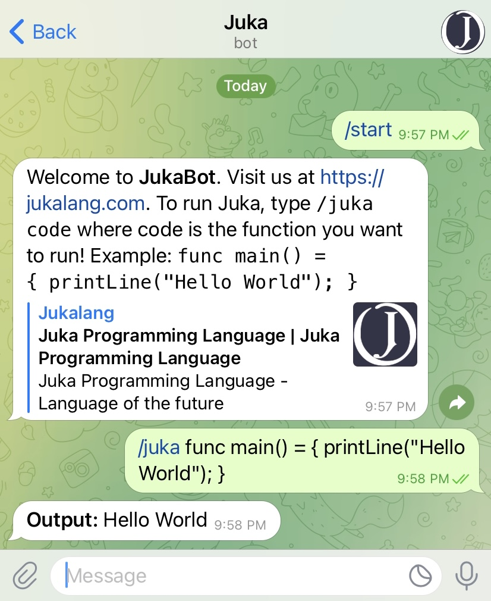

# JukaTelegram
A Juka bot for Telegram. Run Juka code in Telegram!

Send a message to the bot @JukaLangBot on Telegram to get started!
Use command '/juka code' to run Juka code. Example: `/juka func main() = { printLine("Hello World"); }`

## Contributing

Modify index.js and create a pull request. If everything works, we will incorporate it into our build!